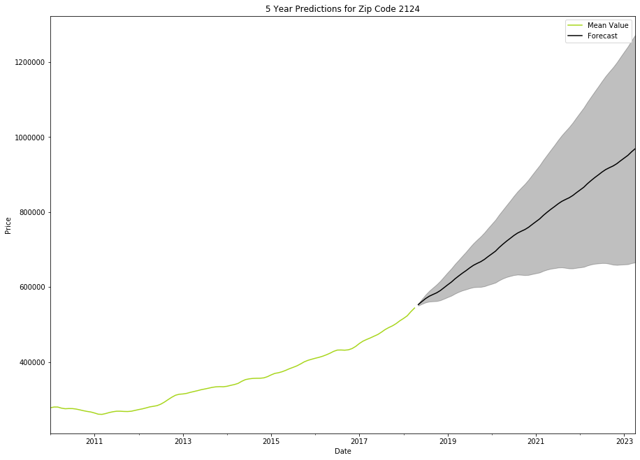

# 👨🏼‍💻 Mod 4 Project
# 👋🏼 Hey, welcome. 

## 🛰️ Navigating This Project 

This one is an easy one - there's only [one notebook](Project%4.ipynb). 

It's pretty self explanatory. My goal was to make a predictive model for real estate prices in a particular area of the country in order to find the '5 Best Zip Codes'.

I focused on: 

(the greater) Boston (area).

# Best Zip Code

# For more info,

Check out my [presentation](Mod%4%Presentation.pdf).

